<div align="center">

# 👋 Hello, I'm TechSobuj


[](https://www.techsobuj.com)
[](https://twitter.com/techsobuj)
[](https://www.linkedin.com/in/lokmanhossainsobuj)
[](mailto:techsobuj@gmail.com)

</div>

---

## 🚀 About Me

```typescript
const techsobuj = {
    role: "Senior Application Developer",
    experience: "6+ years",
    passion: ["Building Scalable Systems", "AI Innovation", "Open Source"],
    currentFocus: ["Web & Mobile Solutions", "AI-Powered Apps", "Next-Gen APIs"],
    lifePhilosophy: "Turn ideas into reality, one commit at a time",
    superpower: "Quick Learning Nitro Boost 🏎️"
};
```

<div align="center">

### 💼 Professional Journey

**Senior Application Developer** | Building Tomorrow's Solutions Today

Crafting innovative digital experiences with cutting-edge technologies and a passion for excellence.

</div>

---

## ⚡ Tech Arsenal

<div align="center">

### 🎯 Core Technologies

<table>
<tr>
<td align="center" width="25%">

<br><strong>Laravel</strong>
</td>
<td align="center" width="25%">

<br><strong>React</strong>
</td>
<td align="center" width="25%">

<br><strong>Vue.js</strong>
</td>
<td align="center" width="25%">

<br><strong>Flutter</strong>
</td>
</tr>
<tr>
<td align="center" width="25%">

<br><strong>JavaScript</strong>
</td>
<td align="center" width="25%">

<br><strong>TypeScript</strong>
</td>
<td align="center" width="25%">

<br><strong>Dart</strong>
</td>
<td align="center" width="25%">

<br><strong>PHP</strong>
</td>
</tr>
</table>

### 🛠️ Tools & Platforms


</div>

---

## 🎯 What I'm Building

```mermaid
mindmap
  root((TechSobuj))
    🌍 Web Solutions
      Scalable APIs
      Modern Frontends
      Microservices
    📱 Mobile Apps
      Cross-platform
      Native Performance
      Beautiful UIs
    🤖 AI Integration
      Smart Automation
      ML Models
      Intelligent Bots
    🔗 Open Source
      Community Projects
      Contributions
      Knowledge Sharing
```

<div align="center">



</div>

<table>
<tr>
<td width="50%">

### 🌟 Current Focus
- 🚀 Building innovative web & mobile solutions
- 🤖 Developing AI-powered applications
- 🏗️ Architecting scalable backend systems
- 📡 Crafting next-generation APIs

</td>
<td width="50%">

### 🤝 Open to Collaborate
- 💡 Exciting full-stack projects
- 🌍 Open-source initiatives
- 🧪 Experimental tech ventures
- 🎓 Knowledge sharing & mentorship

</td>
</tr>
</table>

---

## 📊 GitHub Analytics

<div align="center">
  
  
</div>

<div align="center">
  
</div>

<div align="center">
  
</div>

---

## 🏆 Achievements & Highlights

<div align="center">


</div>

---

## 💭 Dev Quote of the Day

<div align="center">


</div>

---

## 🎵 Coding Vibes

<div align="center">


</div>

---

<div align="center">

### 🌈 "Code is poetry, and every commit is a verse in the epic of innovation"


### ⭐ From [techsobuj](https://github.com/techsobuj) | Let's build the future together!


</div>
